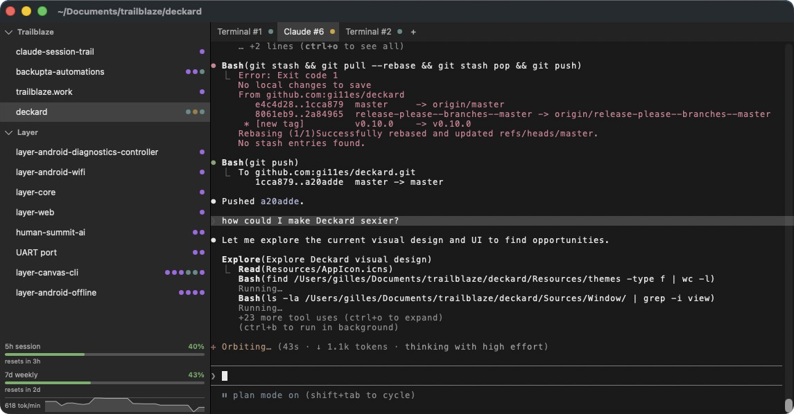

# Deckard

A native macOS terminal manager for [Claude Code](https://docs.anthropic.com/en/docs/claude-code). Run multiple Claude Code sessions side by side in a single window with tabs, projects, and session tracking.

Built with Swift and AppKit. Terminal rendering powered by [Ghostty](https://ghostty.org/).

**[Download the latest release](https://github.com/gi11es/deckard/releases/latest)** (macOS 14+, Apple Silicon)



## Features

- **Multi-tab sessions** — Open multiple Claude Code (and plain terminal) tabs per project. Switch between them with Cmd+1–9 or drag to reorder.
- **Project sidebar** — Organize work by folder. Each project gets its own set of tabs, persisted across restarts.
- **Context usage tracking** — A progress bar shows how much of Claude's context window the active session has consumed.
- **Session state detection** — Tab badges show whether Claude is thinking, waiting for input, needs tool permission, or has errored.
- **macOS notifications** — Get notified when a background tab needs your attention.
- **GPU-accelerated rendering** — Terminal surfaces are rendered through Metal via Ghostty's libghostty.

## Requirements

- macOS 14.0 (Sonoma) or later
- [Claude Code](https://docs.anthropic.com/en/docs/claude-code) CLI installed
- Xcode 16+ (to build from source)

## Building

Deckard uses [Ghostty](https://ghostty.org/) as a git submodule. Clone with submodules, run the setup script (builds GhosttyKit and installs git hooks), then build:

```bash
git clone --recurse-submodules https://github.com/gi11es/deckard.git
cd deckard
./scripts/setup.sh
xcodebuild -project Deckard.xcodeproj -scheme Deckard -configuration Debug build
```

The built app will be in your Xcode DerivedData directory.

## Keyboard Shortcuts

| Shortcut | Action |
|---|---|
| Cmd+T | New Claude tab |
| Shift+Cmd+T | New terminal tab |
| Cmd+W | Close tab |
| Shift+Cmd+W | Close project |
| Cmd+1–9 | Jump to tab |
| Shift+Cmd+[ / ] | Previous / next tab |
| Cmd+O | Open folder |
| Ctrl+Cmd+S | Toggle sidebar |

## How It Works

Deckard wraps the `claude` CLI with a thin hook layer. When Claude Code launches inside a Deckard tab, the wrapper injects lifecycle hooks via a Unix domain socket so the app can track session state, detect context usage, and surface notifications — without modifying Claude Code itself.

## License

MIT
